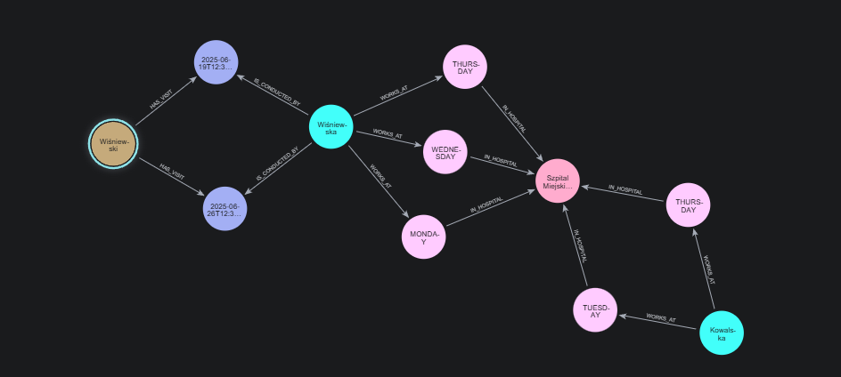
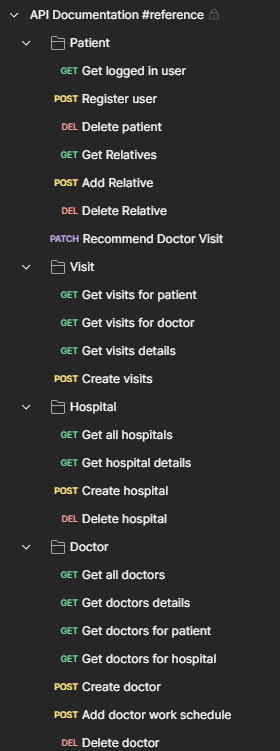
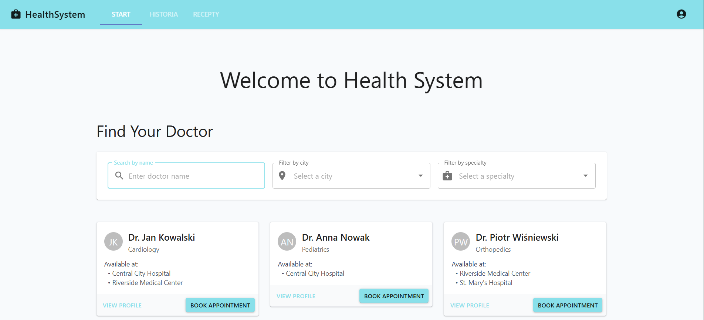
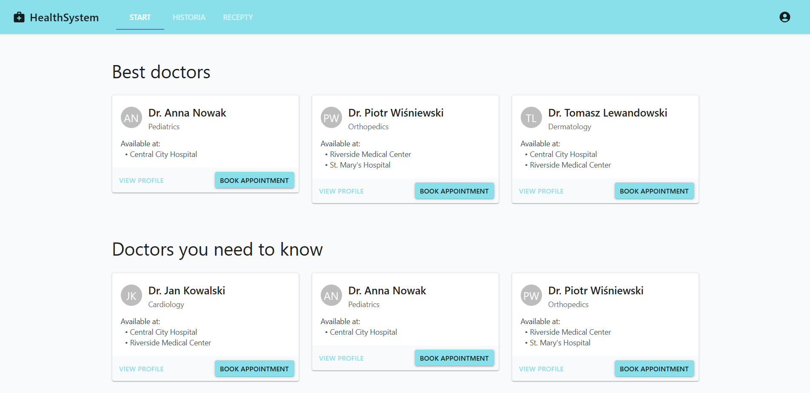
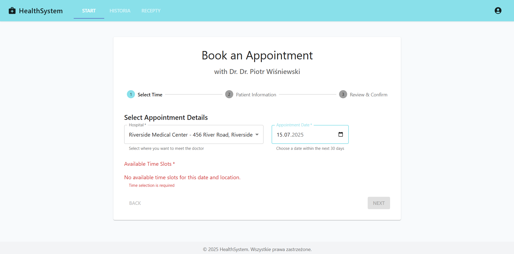
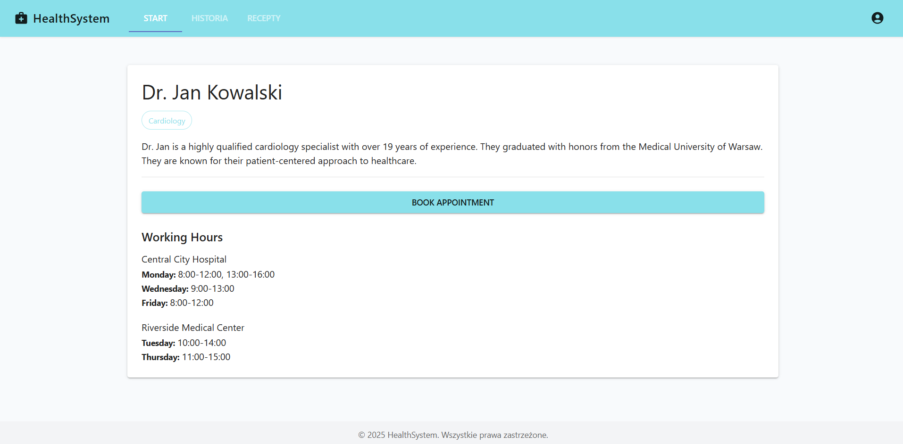

# Portal pacjenta

## Autorzy

- Filip Węgrzyn

- Seweryn Tasior

## Ogólny opis projektu

Celem projektu było stworzenie portalu pacjenta służącego do rezerwacji wizyt u lekarzy. Aplikacja oparta jest na bazie grafowej Neo4J, której zalety jakimi są m. in. elastyczność i modelowanie nieregularnych wielostopniowych relacji między bytami staraliśmy się wykorzystać.

## Technologie

- Neo4J
- Java
- SpringBoot
- TypeScript
- React

## Model bazy danych

Poniżej przedstawione zostały węzły oraz relacje z których składał się nasz model.

### Patient

```java
@Node
public class Patient implements UserDetails {
    @Id @GeneratedValue
    private Long id;
    private String firstName;
    private String lastName;
    private String username;
    private String email;
    private String password;
    private LocalDate dateOfBirth;
    private String gender;

    @Relationship(type = "HAS_VISIT")
    private List<Visit> visits;
    }
```

### Doctor

```java
@Node
public class Doctor {
    @Id @GeneratedValue
    private Long id;
    private String firstName;
    private String lastName;
    private String specialty;

    @Relationship(type = "WORKS_AT")
    private List<WorkDaySchedule> schedules;
}
```

### Visit

```java
@Node
public class Visit {
    @Id @GeneratedValue
    private Long id;
    private LocalDateTime date;
    private String patientsCondition;
    private boolean recommends;

    @Relationship(type = "CONDUCTED_BY", direction = Relationship.Direction.INCOMING)
    private Doctor doctor;

    @Relationship(type = "TOOK_PLACE_IN")
    private Hospital hospital;
}
```

### Hospital

```java
@Node
public class Hospital {
    @Id @GeneratedValue
    private Long id;
    private String name;
    private String address;
    private String email;
    private String phone;
}
```

### WorkDaySchedule

```java
@Node
public class WorkDaySchedule {
    @Id @GeneratedValue
    private Long id;
    private DayOfWeek dayOfWeek;
    private LocalTime startTime;
    private LocalTime endTime;

    @Relationship(type = "IN_HOSPITAL")
    private Hospital hospital;
}
```


Przykładowy fragment bazy danych

## Endpointy



Aplikacj oferuje kompletne operacje odczytu, zapisu i usuwania danych.  
W szczególności można wyróżnić np. odczyt rekomendowanych lekarzy który dzieli się na 2 wersje:

- lekarze rekomendowani przez znajomych (punkty przyznawane są za każdą pozytywnie ocenioną wizytę, waga jest odwrotnie proporcjonalna do stopnia odległości w sieci znajomych)
- lekarze rekomendowani ogólnie (suma pozytywnie ocenionych wizyt)

Dokładniejszy wgląd w strukturę zapytań i odpowiedzi możliwy jest pod tym linkiem:  
https://www.postman.com/sewery/health-system-backend/collection/37bs76v/restful-api-basics-blueprint

## Operacje na bazie danych

Operacje na bazie danych odbywają się za pośrednictwem mapowania obiektowo-relacyjnego zapewnionego przez Spring Data Neo4J.

Operacje są przerywane i zwracane są odpowiednie komunikaty i kody błędu w przypadku następujących wyjątkowych sytuacji:

- brak zasobu - nie znaleziono któregokolwiek wpisu po ID
- próba polecenia wizyty - pacjent już poleca wizytę
- próba dodania znajomego - pacjenci są już znajomymi
- próba dodania godzin pracy lekarza - godziny pracy tego dnia już istnieją
- próba rezerwacji wizyty - termin jest niedostępny

Usuwanie danych:

- wraz z lekarzem usuwane są jego przyszłe wizyty i jego godziny pracy
- wraz ze szpitalem usuwane są przyszłe wizyty które w nim się odbywają
- wraz z pacjentem usuwane są jego wszystkie wizyty
- wraz z dniem pracy lekarza usuwane są wizyty które wtedy się odbywają

Bezpośrednie operacje na bazie:

### DoctorRepository

```java
public interface DoctorRepository extends Neo4jRepository<Doctor, Long> {
    @Query("""
    MATCH (h:Hospital {id: $hospitalId}) <-[:WORKS_AT]-(docs:Doctor)
    RETURN docs""")
    List<Doctor> findDoctorsByHospitalId(Long hospitalId);

    @Query("MATCH (:Patient {id: $patientId}) <- [:BELONGS_TO_PATIENT] - (:Visit) <- [:CONDUCTED_BY] - (docs:Doctor) RETURN docs")
    List<Doctor> findDoctorsByPatientId(Long patientId);
}
```

### PatientRepository

```java
public interface PatientRepository extends Neo4jRepository<Patient, Long> {
    Optional<Patient> findPatientByUsername(String username);

    @Query("""
    MATCH (p:Patient)-[:HAS_VISIT]->(v:Visit)
    WHERE id(p) = $patientId
    RETURN p, collect(v)
""")
    Optional<Patient> findWithVisitsById(Long patientId);

    @Query("""
        MATCH (:Patient {id: $patientId}) - [:IS_RELATED] - (relatives:Patient)
        RETURN relatives
    """)
    List<Patient> findRelativesById(Long patientId);

    @Query("""
        MATCH (:Patient {id: $patientId}) - [:IS_RELATED*1..$depth] - (relative:Patient)
        RETURN DISTINCT relative
    """)
    List<Long> findNthRelativesIdsByPatientId(Long patientId, int depth);

    @Query("RETURN EXISTS { MATCH (:Patient {id: $patientId}) -[:IS_RELATED]- (:Patient {id: $relativeId}) }")
    boolean verifyIsRelative(Long patientId, Long relativeId);

    @Query("""
        MATCH (patient:Patient {id: $patientId}) -[r:IS_RELATED]- (relative:Patient {id: $relativeId})
        DELETE r
    """)
    void deleteRelative(Long patientId, Long relativeId);

    @Query("""
        MATCH (patient:Patient {id: $patientId})
        MATCH (relative:Patient {id: $relativeId})
        CREATE (patient)-[:IS_RELATED]->(relative)
    """)
    void addRelativeToPatient(Long patientId, Long relativeId);

    @Query("""
        MATCH (patients:Patient) - [:HAS_VISIT] -> (v:Visit) - [:IS_CONDUCTED_BY] -> (:Doctor {id: $doctorId})
        RETURN patients, v
    """)
    List<Patient> findByDoctorId(Long doctorId);
}
```

### VisitRepository

```java
public interface VisitRepository extends Neo4jRepository<Visit, Long> {
    @Query("""
    MATCH (p:Patient {id: $patientId})
    MATCH (p)-[:HAS_VISIT]->(v:Visit)
    MATCH (v)<-[:CONDUCTED_BY]-(d:Doctor)
    OPTIONAL MATCH (v)-[:TOOK_PLACE_IN]->(h:Hospital)
    RETURN v, d, h
""")
    List<Visit> findByPatientId(Long patientId);

    @Query("""
    MATCH (d:Doctor {id: $doctorId})
    MATCH (v:Visit)-[:CONDUCTED_BY]->(d)
    OPTIONAL MATCH (v)-[:TOOK_PLACE_IN]->(h:Hospital)
    RETURN v, d, h
    """)
    List<Visit> findByDoctorId(Long doctorId);

    @Query("""
    MATCH (v:Visit)-[:TOOK_PLACE_IN]->(h:Hospital {id: $hospitalId})
    OPTIONAL MATCH (v)<-[:CONDUCTED_BY]-(d:Doctor)
    RETURN v, d, h
""")
    List<Visit> findByHospitalId(Long hospitalId);

    @Query("""
    RETURN EXISTS{
    MATCH (d:Doctor {id: $doctorId})
    MATCH
      (d)<-[:CONDUCTED_BY]-(v:Visit)
    WHERE date(v.date).year = date($date).year AND
          date(v.date).month = date($date).month AND
          date(v.date).day = date($date).day AND
          abs(duration.between(v.date, $date).minutes) <= $visitDuration}
    """)
    boolean areVisitsColliding(Long doctorId, LocalDateTime date, int visitDuration);
}
```

## Strona klienta

### Strona główna

Na stronie głównej znajduje się wyszukiwarka lekarzy. Możliwe jest filtrowanie zarówno po lokalizacji szpitala jak i po specjalizacji lekarza. Dodatkowo widoczni są polecani lekarze.



### Strona rezerwacji

Na stronie rezerwacji możliwe jest wybranie jednego ze szpitali w którym lekarz pracuje oraz zaznaczenie interesującej nas daty.


### Strona lekarza

Na stronie lekarza widoczne są jego dane i standardowe godziny pracy w konkretnych szpitalach.


